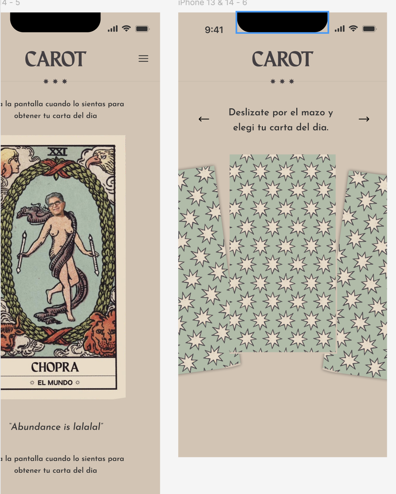

## Summary

Add a **light mode** to El Carot, based on the reference the user uploaded: a warm taupe/beige page background (≈ `--carot-taupe` #d5c3b2, the exact value to be eyedropped from the reference), dark ink text and star dividers, the "CAROT" wordmark in ink, and sage card backs that pop against the light page. Dark stays as it is today. The first visit follows the device's light/dark setting; a sun/moon button next to the ES/EN toggle lets the visitor switch, and the choice is remembered across visits with no flash of the wrong theme on load.

## Key Decisions

- **System default + manual toggle, remembered** (user's choice). Resolution order mirrors language: saved `carot_theme` cookie → `prefers-color-scheme` → dark. The cookie is read server-side so the `<html data-theme>` attribute is right on first paint; when there is no cookie, a tiny inline script in `<head>` applies the system preference before hydration (no flash).
- **Theme by CSS variables, not by per-component branching.** Components already lean on `var(--carot-…)` tokens, but ~60 hardcoded colors (`#2b2922`, `#5B6256`, `rgba(175,188,167,…)`, `rgba(233,217,199,…)`, `rgba(255,255,255,.3x)`, `#202020`, `#14110e`) live in ~25 components (`MessageIntro`, `Comments`, `Footer`, `ReadingMobile`, `QuestionInput`, `CardFan`, `AboutScreen`, `LangToggle`, `CarotMenu`, `DeckArc`, `GalleryGrid`, `app/stats/page.tsx`, …). Each one moves to a semantic token (`--surface-page`, `--text-body`, `--text-heading`, `--text-muted`, `--divider`, `--border-soft`, `--text-on-sage`, `--overlay`, `--shadow-strong`) that gets a light value under `[data-theme="light"]`. That keeps the change mechanical and makes any future theme free.
- **Card art is not themed.** Card fronts and the sage card back (`/assets/card-back.jpg`) stay as-is; only their border/shadow tokens soften in light mode (dark drop-shadows look muddy on taupe).
- **Light palette** (starting values, tune at build against the reference): page `#d5c3b2`; text/headings/wordmark/stars ink `#353029`; secondary text `#5b5247`; dividers/hairlines `rgba(53,48,41,.18)`; primary button stays sage `--carot-sage` with `#2b2922` text; outline buttons ink at ~35%. Meet WCAG AA for body text.
- **`themeColor`** in `app/layout.tsx` becomes per-scheme (`#202020` dark / taupe light) so the mobile browser chrome matches.

## Implementation

### 1. Tokens: dark + light palettes

**File**: `app/globals.css`

Keep the existing `:root` palette as the dark theme. Add the missing semantic tokens (see Key Decisions) to `:root` with their current dark values, then a `[data-theme="light"]` block that overrides the semantic aliases and `--carot-screen` / `--carot-cream-text` / `--carot-sage-light` usages that act as "page / body text / heading". `html, body`, `.carot-shell` keep reading `var(--carot-screen)` so they switch automatically.

### 2. Theme state, persistence, no-flash

**File**: `middleware.ts` — read `carot_theme` cookie (`light` | `dark`) and forward it as `x-carot-theme`, the same way `carot_lang` → `x-carot-lang` works today.

**File**: `app/layout.tsx` — set `<html data-theme={…}>` from the header when the cookie exists; otherwise inject a small inline `<head>` script that sets `data-theme` from `matchMedia('(prefers-color-scheme: light)')`. Make `themeColor` an array with `media` per scheme.

**New file**: `lib/theme.tsx` — `ThemeProvider` / `useTheme()` exposing `theme` and `setTheme`; `setTheme` updates `document.documentElement.dataset.theme`, writes the cookie (1 year) and localStorage, wrapped in try/catch like `setLang` in `lib/i18n.tsx`. A pure `resolveTheme(cookie, prefersLight)` helper with tests in **new file** `lib/theme.test.ts`.

### 3. Sun/moon toggle

**New file**: `components/ThemeToggle.tsx` — minimal icon button matching `LangToggle`'s size and weight, with `aria-label` from i18n (`themeLight` / `themeDark` strings added to `lib/i18n.tsx`, ES + EN). Placed next to `LangToggle` in `components/HomeHeader.tsx` (mobile) and `components/NavRightCluster.tsx` (desktop), and as an item in the menu (`components/CarotMenu.tsx`) so it's reachable from every page.

### 4. Replace hardcoded colors with tokens

**Files**: every component in `components/` and `app/stats/page.tsx` that has a literal hex/rgba color (the grep `#[0-9a-fA-F]{6}|rgba\(` over `components app --include='*.tsx'` is the checklist; ~60 occurrences). Swap each for the matching semantic token. Leave card-art-only values (inside `TarotCard`'s face/back) alone. After the sweep that grep should only hit intentional, theme-independent values, each with a short comment.

### 5. Scenarios

Add a light variant for the main screens (see below) so both themes are captured side by side; the theme is set per scenario via the `data-theme` attribute / cookie mock, not via a launch-time env var.

## Reused existing code

- `CarotProvider` / `useCarot` in `lib/i18n.tsx` — cookie + localStorage persistence pattern for `setTheme`.
- `middleware.ts` — the `carot_lang` cookie → `x-carot-lang` header pattern, extended for `carot_theme`.
- `LangToggle` from `components/LangToggle.tsx` (glossary entry: `LangToggle`) — visual style for the new toggle.
- `HomeHeader` from `components/HomeHeader.tsx` (glossary entry: `HomeHeader`) and `NavRightCluster` from `components/NavRightCluster.tsx` (glossary entry: `NavRightCluster`) — where the toggle lives.
- Existing palette in `app/globals.css` — `--carot-taupe`, `--carot-ink`, `--carot-ink-soft` already exist and match the reference.
- Existing-implementation survey: no theme state, `data-theme`, or `prefers-color-scheme` handling exists anywhere in `app/`, `components/`, `lib/` today (only `themeColor: '#202020'` in `app/layout.tsx`).

## Scenarios to Demonstrate

- Home — light (mobile + desktop), compared to dark.
- Message deck carousel — light (matches the right-hand reference screen: taupe page, sage card backs, ink arrows).
- Card reading — light, with and without question (matches the left-hand reference).
- Question input, Gallery, About, Comments with comments, Footer — light.
- Menu overlay open in light.
- Toggle states: system=light with no cookie; cookie=dark overriding a light system; switching live.
- Spanish and English labels on the toggle.