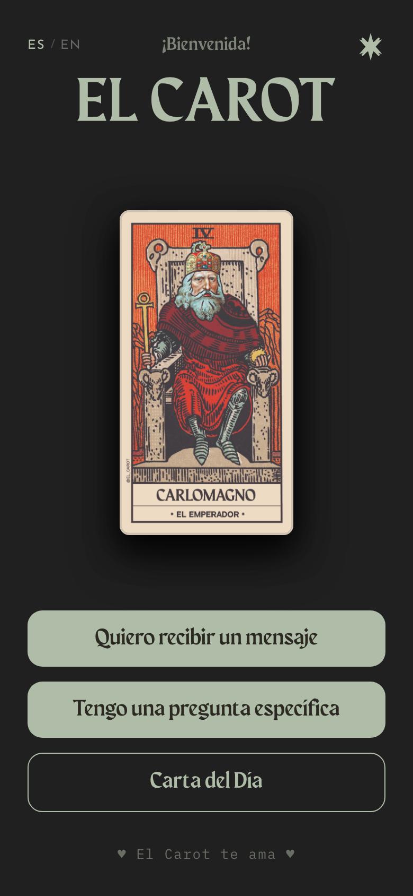
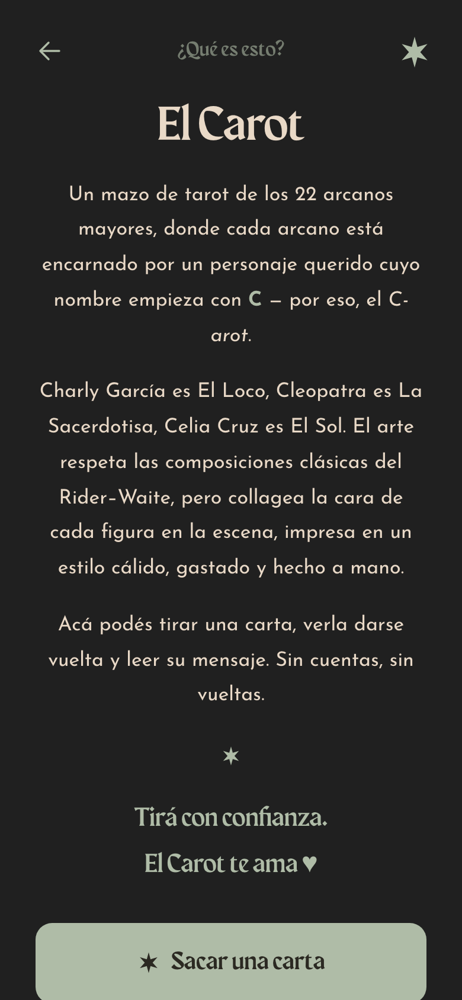
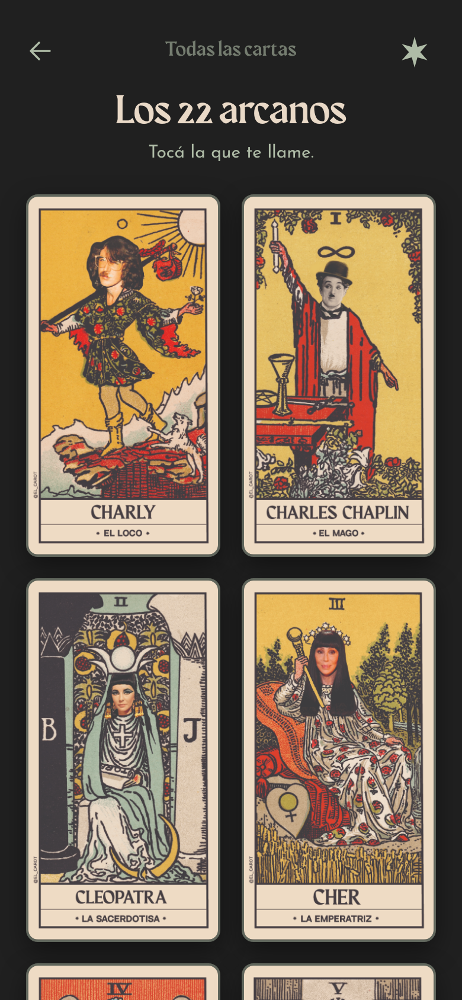
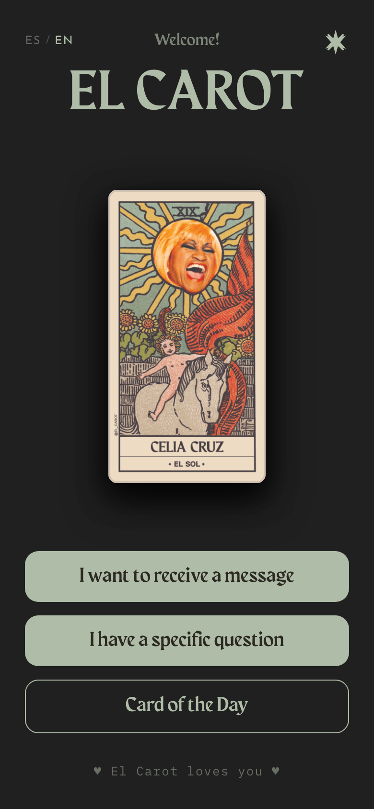
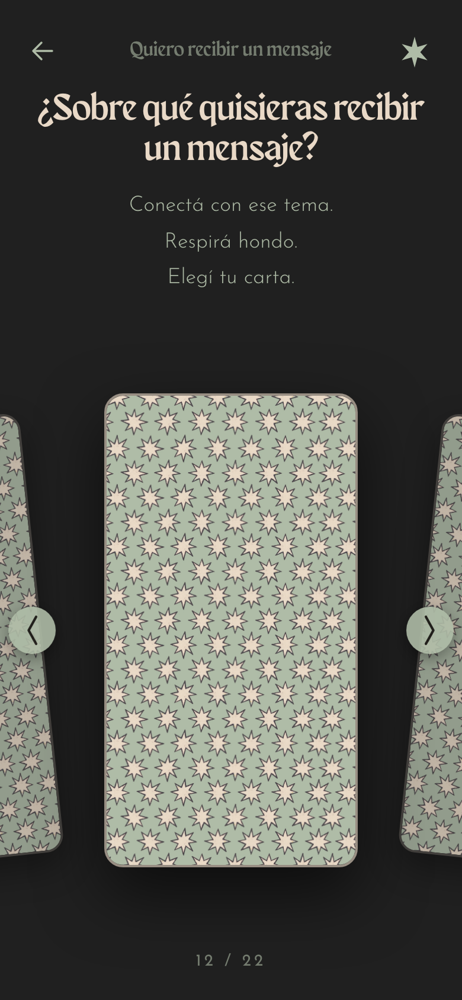
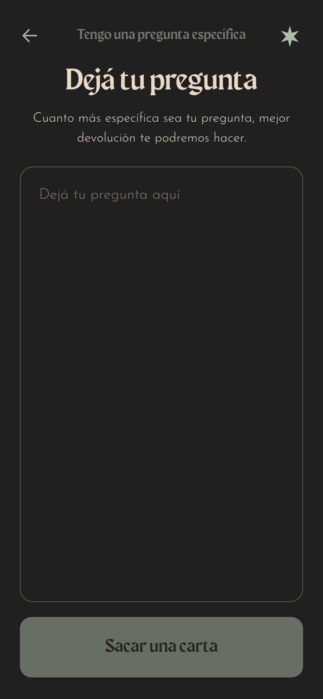
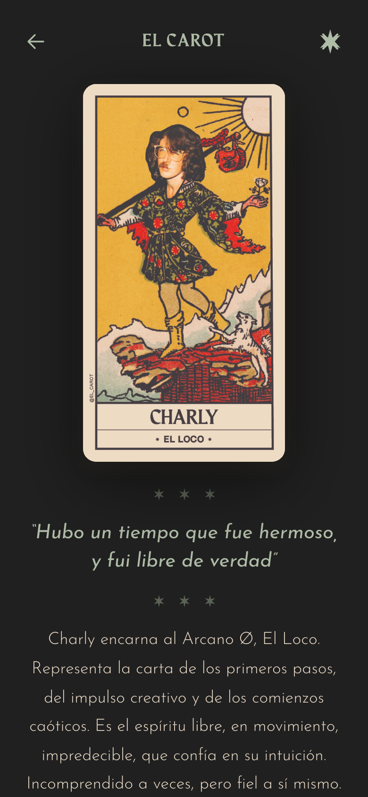
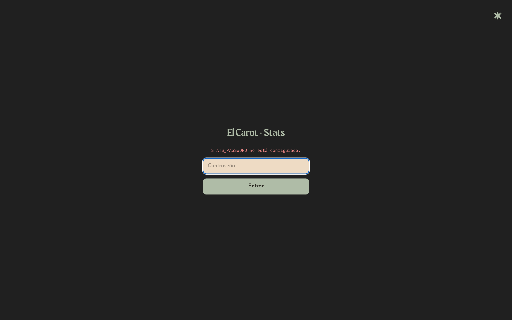

# El Carot

[](https://github.com/codeyam-ai/el-carot/actions/workflows/ci.yml)
[](./LICENSE)

**Tarot readings from a deck where every arcanum is someone you already love.**

Charly García is El Loco. Cleopatra is La Sacerdotisa. Celia Cruz is El Sol. Pick a
theme or ask a question, choose your card, and get a thoughtful reading back — in
Spanish or English. No account, no sign-up, no strings.

Live at **[elcarot.com](https://www.elcarot.com)**. Built with [CodeYam](https://codeyam.com).

<p align="center">
  
</p>

## Tech stack

- [Next.js](https://nextjs.org/) (App Router)
- [Prisma](https://www.prisma.io/) + [Neon](https://neon.tech/) Postgres
- Optional [Anthropic](https://www.anthropic.com/) API for AI card interpretations
- [Vitest](https://vitest.dev/) + [Playwright](https://playwright.dev/) for tests

## Getting started

```bash
# 1. Install dependencies
npm install

# 2. Configure environment
cp .env.example .env
# then fill in DATABASE_URL (Neon Postgres) and, optionally, ANTHROPIC_API_KEY

# 3. Set up the database and seed it
npm run setup        # install + db:push + db:seed

# 4. Run the dev server
npm run dev
```

The app runs at [http://127.0.0.1:3000](http://127.0.0.1:3000).

## Environment variables

| Variable            | Required | Description                                                      |
| ------------------- | -------- | ---------------------------------------------------------------- |
| `DATABASE_URL`      | Yes      | PostgreSQL connection string. Production uses Neon.              |
| `ANTHROPIC_API_KEY` | Optional | Enables AI card interpretations. Falls back to written meanings. |
| `STATS_PASSWORD`    | Optional | Password gate for the `/stats` analytics page.                   |
| `CRON_SECRET`       | Optional | Auth for the daily "card of the day" cron job.                   |

See [`.env.example`](./.env.example) for the annotated template, and
[DATABASE.md](./DATABASE.md) for the schema workflow.

## Scripts

- `npm run dev` — start the dev server
- `npm run build` — production build
- `npm run test` — run tests (Vitest)
- `npm run db:push` / `npm run db:seed` — sync and seed the database

## Contributing

Issues and pull requests are welcome — see **[CONTRIBUTING.md](./CONTRIBUTING.md)**
for setup, the four checks CI runs, and how scenarios work. By participating you
agree to the [Code of Conduct](./CODE_OF_CONDUCT.md). For security issues, please
read [SECURITY.md](./SECURITY.md) rather than opening a public issue.

## License

[MIT](./LICENSE) © 2026 CodeYam

<!-- codeyam:run-and-edit:start -->
## Develop this project with codeyam-editor

This project is built with [codeyam-editor](https://codeyam.com) — code and runnable data scenarios are authored side by side against a live preview.

```bash
# Clone the repo
git clone https://github.com/codeyam-ai/el-carot && cd el-carot

# Install codeyam-editor
npm install -g @codeyam-editor/codeyam-editor@latest

# Launch the editor (split-screen terminal + live preview)
codeyam-editor editor
```
<!-- codeyam:run-and-edit:end -->

<!-- codeyam:scenario-gallery:start -->
## Scenario gallery

States captured as runnable scenarios with codeyam-editor:

### About - Default



### Gallery - Default



### Landing - English



### Landing - Spanish


### Message - Default



### Question - Empty



### Reading - Default



### Stats - Password Gate


<!-- codeyam:scenario-gallery:end -->
